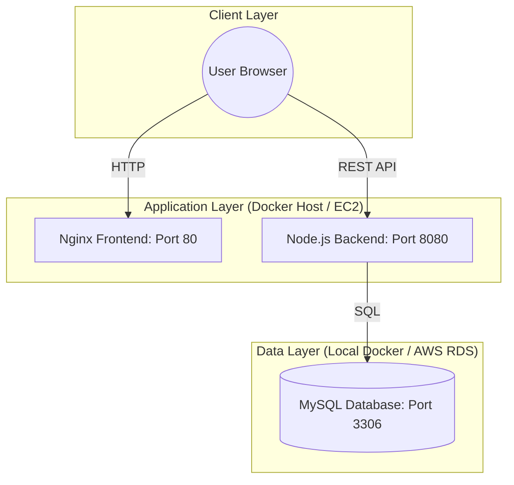
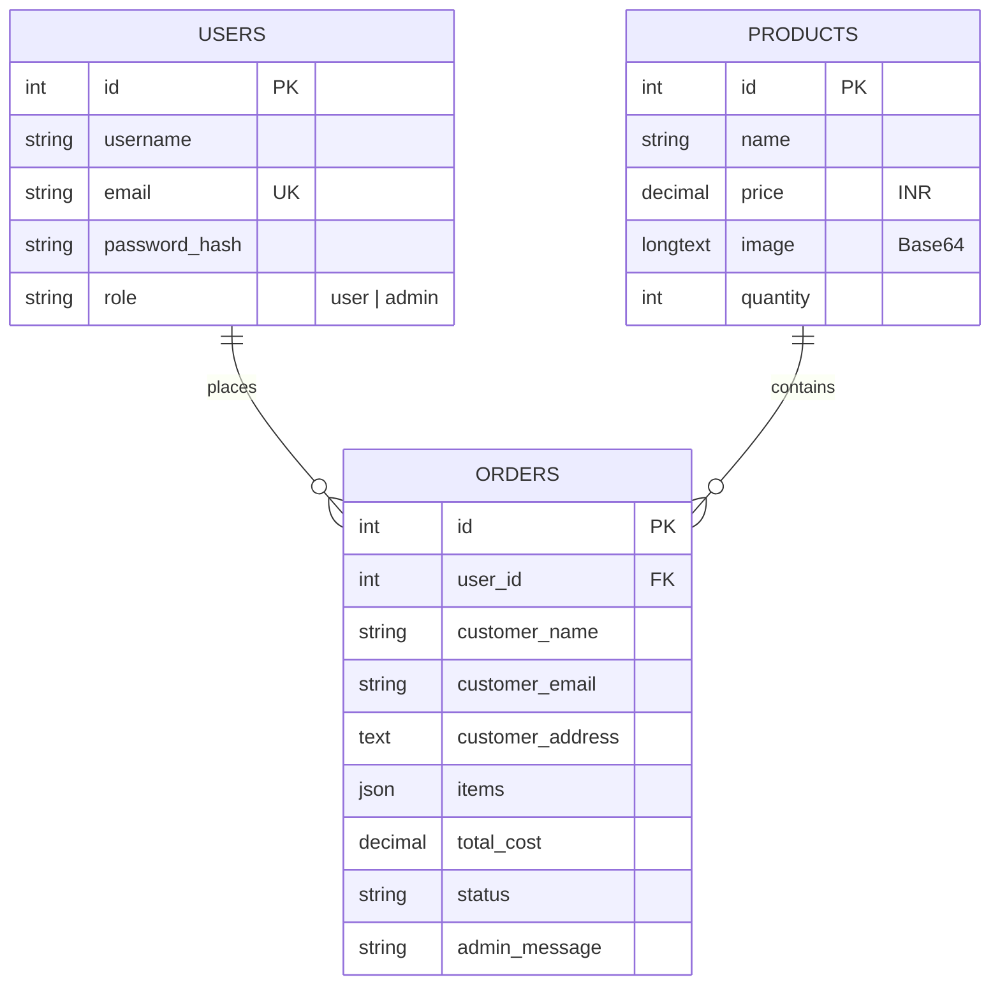

# 🥖 Pune Bakery - End-to-End Containerized Web Application

A professional, full-stack bakery management system designed with **DevOps best practices**. This project demonstrates a complete lifecycle from local development to **AWS Cloud Deployment** using Docker, EC2, and RDS.

---

## 🏗️ System Architecture

The application follows a modern multi-tier architecture, containerized for consistency across environments.



---

## ✨ Core Features

### 🔐 Security & Authentication
- **Role-Based Access**: Separate portals for Customers and Employees/Admins.
- **Secure Hashing**: User passwords are encrypted using `bcryptjs` before storage.
- **Dynamic API Detection**: Frontend automatically connects to the correct backend IP (Local or Cloud).

### 🛍️ Customer Experience
- **Product Gallery**: Real-time menu display with pricing in **INR (₹)**.
- **Shopping Cart**: Seamless add-to-cart and calculation logic.
- **Dummy Payment Gateway**: Simulated QR Code payment with a 10-second processing delay.
- **Order Tracking**: Real-time status updates (Baking, Out for Delivery, etc.) visible to customers.

### 🛠️ Admin Capabilities
- **Inventory Management**: Add, edit, or delete products with **Base64 Image support**.
- **Order Fulfillment**: View all customer orders and send custom messages/status updates.

---

## 📊 Database Schema (ERD)



---

## � Getting Started (Local Setup)

Follow these steps to run the entire project on your laptop in under 5 minutes.

### 1. Prerequisites
- [Docker Desktop](https://www.docker.com/products/docker-desktop/) installed and running.
- [MySQL Workbench](https://dev.mysql.com/downloads/workbench/) (optional, for DB verification).

### 2. Clone the Repository
```bash
git clone https://github.com/siddheshsomvanshi1/Bakery_Project_Docker.git
cd "Bakery_Project_Docker/BakeryProject_new-main/Containerized Bakery Web Application"
```

### 3. Initialize the Database
1. Open MySQL Workbench and connect to your local instance (Port 3306).
2. Execute the script found in: `db/bakery_schema.sql`.
   - *Note: This project uses port **3307** locally for Docker to avoid conflicts with your system's MySQL.*

### 4. Launch the Application
Run the following command in your terminal:
```bash
docker-compose up --build -d
```

### 5. Access the App
- **Frontend**: [http://localhost](http://localhost)
- **Login/Register**: [http://localhost/employee_login.html](http://localhost/employee_login.html)
- **Admin Portal**: [http://localhost/admin_login.html](http://localhost/admin_login.html)
  - **Credentials**: `admin` / `admin123`

---

## ☁️ AWS Cloud Deployment Guide

### Phase 1: Infrastructure (RDS & EC2)
1. **RDS (MySQL)**: 
   - Create a Free Tier instance.
   - Set **Public Access: Yes** (for initialization).
   - Initialize with `db/bakery_schema.sql`.
2. **EC2 (Ubuntu)**:
   - Launch a `t2.micro` instance.
   - **Security Group Rules**: Open Ports **80** (HTTP), **8080** (API), and **22** (SSH).

### Phase 2: Configuration
Edit `docker-compose.yml` on the EC2 instance to point to your RDS Endpoint:
```yaml
environment:
  DB_HOST: your-rds-endpoint.amazonaws.com
  DB_USER: root
  DB_PASS: yourpassword
```

### Phase 3: Launch
```bash
sudo docker-compose up --build -d
```

---

## 👨‍💻 Technologies Used
- **Frontend**: HTML5, CSS3, Bootstrap 5, jQuery.
- **Backend**: Node.js, Express (Pure HTTP logic).
- **Database**: MySQL 8.0.
- **DevOps**: Docker, Docker-Compose, AWS EC2, AWS RDS.

---
*Created by Siddhesh Somvanshi - Professional DevOps Portfolio Project*
