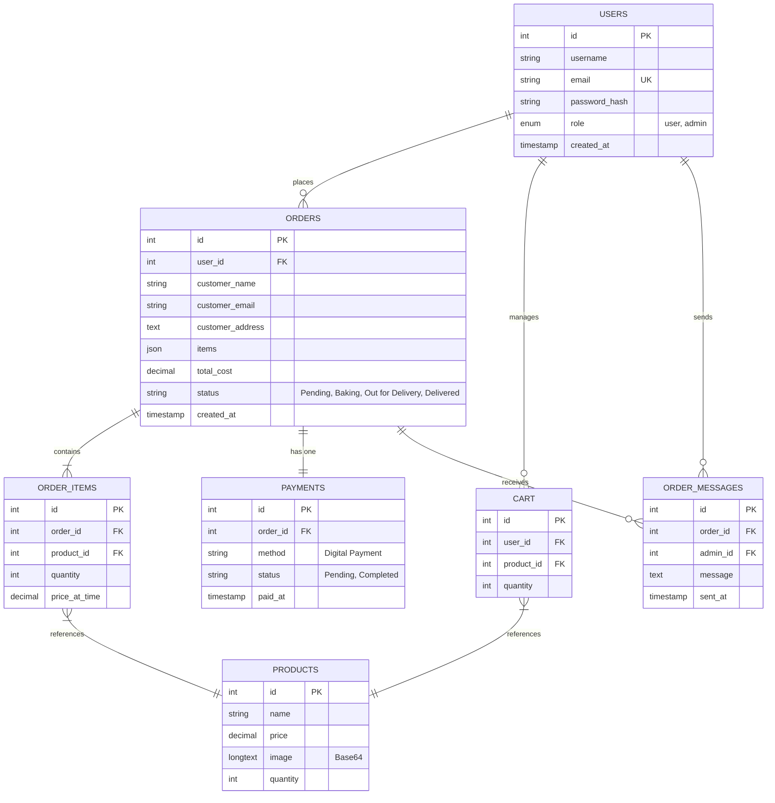
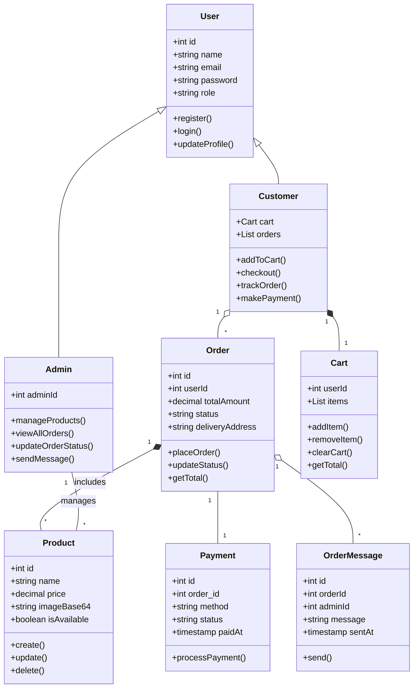
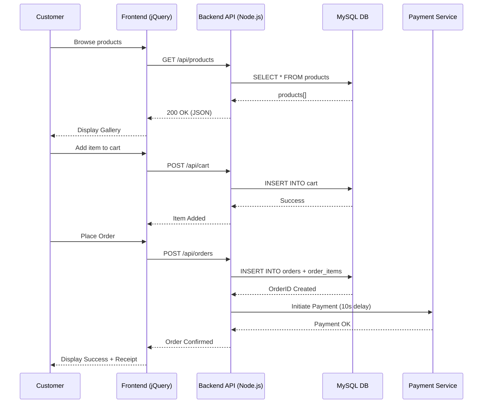
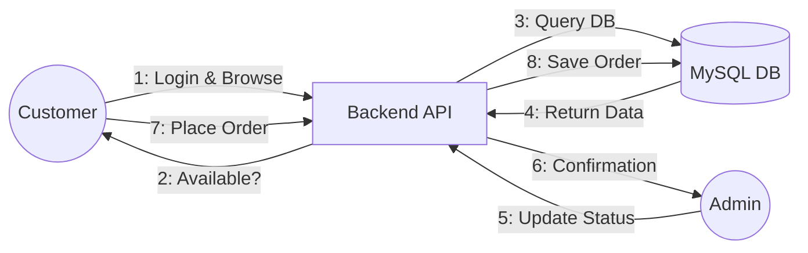
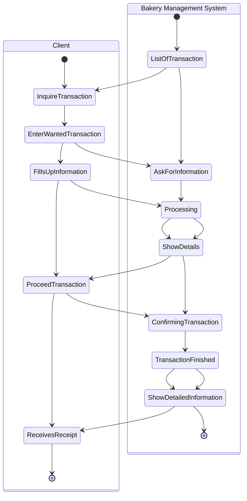
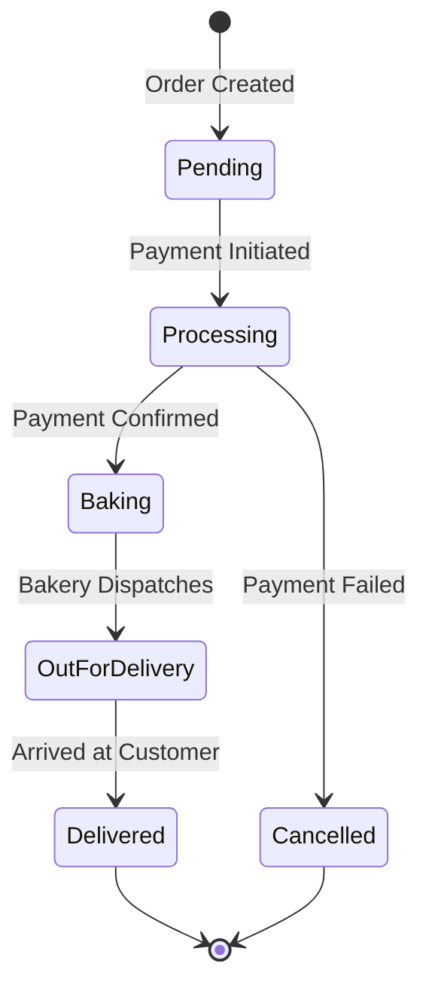
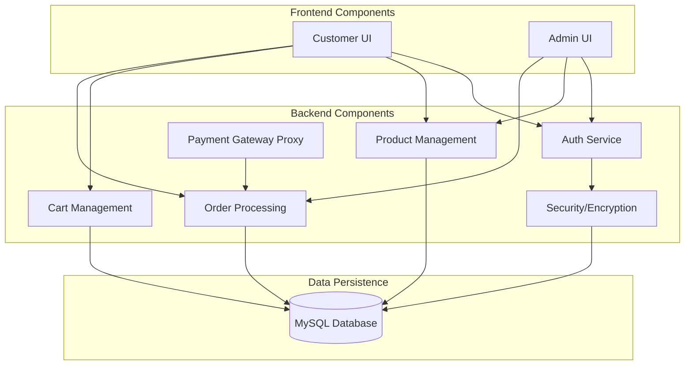

lOMoARcPSD|57107847 
File Pdf - ftri7t 
File Pdf - ftri7t 
Bcs bachelor Computer science (Savitribai Phule Pune University) 
Bcs bachelor Computer science (Savitribai Phule Pune University) 
Scan to open on Studocu 
Scan to open on Studocu 
Studocu is not sponsored or endorsed by any college or university 
Studocu is not sponsored or endorsed by any college or university 
Downloaded by Komal Kazgar (komalkazgar@gmail.com) 
lOMoARcPSD|57107847 

A 
Project Report 
“Pune Bakery — End-to-End Containerized Web Application” 
Submitted To 
SAVITRIBAI PHULE PUNE UNIVERSITY, PUNE  
Towards partial Fulfillment for the Award of  
Master of Computer Applications  
Submitted By 
Mr. Ganesh Jadhav 
Under the supervision of  
Prof. [Guide Name]  
____________________________________________          
_____________________________________________ 
Downloaded by Komal Kazgar (komalkazgar@gmail.com) 
____________________________________________          _____________________________________________ 
                                                    Department of MCA 
 Indira College of Engineering and Management, Pune 
 2024-25 

---

lOMoARcPSD|57107847 
lOMoARcPSD|57107847 

## INDEX 
### Mini Project Using Software Engineering Techniques 

| Sr.No | Content | P.G.No. | Remark |
| :--- | :--- | :--- | :--- |
| **1** | **Structural Model:** | | |
| | • Introduction | 4 | |
| | • Acknowledgement | 5 | |
| | • Abstract | 6 | |
| | • Problem Definition | 7 | |
| | • Scope of proposed system | 8 | |
| | • Requirement Specification | 9 | |
| | • ER Diagram | 12 | |
| | • Use Case Diagram | 13 | |
| | • Class Diagram | 14 | |
| **2** | **Behavioural Model:** | | |
| | • Sequence Diagram | 15 | |
| | • Collaboration Diagram | 16 | |
| | • Activity Diagram | 17 | |
| | • State Chart Diagram | 18 | |
| **3** | **Architectural Model:** | | |
| | • Component Diagram | 19 | |
| | • Deployment Diagram | 20 | |
| | • Package Diagram | 21 | |
| | • Conclusion | 22 | |
| | • Bibliography | 23 | |

____________________________________________          
3 
_____________________________________________ 
Downloaded by Komal Kazgar (komalkazgar@gmail.com) 
____________________________________________          _____________________________________________ 

---

## 1] Structural Model 

### Introduction to the Pune Bakery System 
**Basic Functions:** 
The Pune Bakery system is a full-stack, production-grade bakery management system. It demonstrates a complete software lifecycle from local development to cloud deployment on AWS, using Docker containerization, a managed RDS database, and a multi-tier Node.js + Express architecture.

**Core Features:**
- **Role-Based Access:** Separate portals for Customers and Admin/Employees with secure password hashing.
- **Product Management:** Admin can add, edit, and delete products with image support.
- **Shopping Cart and Orders:** Customers browse the menu, manage a cart, and place orders with pricing in INR.
- **Digital Payment Processing:** Integrated digital payment simulation with processing delays for realism.
- **Real-Time Order Tracking:** Status updates (Pending, Baking, Out for Delivery, Delivered) visible to customers.
- **Admin Messaging:** Admin can send custom status messages to customers per order.

**Role in the Economy:**
- **Financial Intermediation:** Facilitates sales between the bakery and its customers.
- **Economic Development:** Provides capital for business growth through digital sales.
- **Monetary Stability:** Ensures transparent and stable pricing policies.
- **Credit Creation:** Supports digital transaction tracking to stimulate economic activity.

**Evolution of the System:** 
Traditional bakeries relied on manual, paper-based systems, but the Pune Bakery system leverages modern containerization and cloud infrastructure to offer a robust, scalable digital experience.

**Regulation and Supervision:** 
The system enforces data integrity through MySQL constraints and secure access through encrypted credentials and AWS Security Groups.

**Challenges:** 
Modern bakery systems face challenges like maintaining data consistency in high-traffic periods, ensuring cybersecurity for user data, and managing cloud infrastructure costs.

4 
Downloaded by Komal Kazgar (komalkazgar@gmail.com) 
lOMoARcPSD|57107847 
lOMoARcPSD|57107847 

---

### Acknowledgement of the Pune Bakery System 
The Pune Bakery system plays a crucial role in modernizing local food businesses, and its importance can be acknowledged in several key areas: 

1. **Economic Stability:** By automating inventory and orders, the system maintains business stability and reduces human error. 
2. **Facilitation of Trade:** Reliable payment mechanisms and digital catalogs enhance the efficiency of sales and customer interaction. 
3. **Financial Inclusion:** The system allows traditional businesses to reach a wider digital audience, empowering them economically in a tech-driven market. 
4. **Risk Management:** Centralized database storage ensures that all transactions and product details are accurately tracked and managed. 
5. **Support for Innovation:** By using Docker and AWS, the project demonstrates how modern DevOps practices can be applied to everyday retail problems. 
6. **Consumer Protection:** Secure login and transparent order tracking foster trust between the bakery and its customers. 

____________________________________________          
5 
_____________________________________________ 
Downloaded by Komal Kazgar (komalkazgar@gmail.com) 
____________________________________________          _____________________________________________ 

---

### Abstract of the Pune Bakery System:- 
The Pune Bakery System is a containerized, full-stack web application managing the complete lifecycle of a bakery business — from product catalogue management to customer ordering, payment processing, and delivery tracking. The system is built on a modern multi-tier model: an HTML/CSS/jQuery frontend served via Nginx, a Node.js + Express RESTful backend API, and a MySQL 8.0 relational database.

This abstract explores the key functions of the Pune Bakery system, including product management, order facilitation, and real-time delivery tracking. It also highlights the importance of the containerized environment (Docker) and cloud-native deployment (AWS) that ensure system reliability and scalability. These technologies collectively enhance the integrity of the bakery's digital operations.

In addition to its economic roles, the system contributes to digital inclusion, enabling local businesses to access modern financial and retail services. By fostering innovation and providing robust support for business operations, the Pune Bakery system plays a pivotal role in driving local economic development. This abstract underscores the importance of understanding the system's structure, functions, and deployment environment to appreciate its impact on the business and its customers.

6 
Downloaded by Komal Kazgar (komalkazgar@gmail.com) 
lOMoARcPSD|57107847 
lOMoARcPSD|57107847 

---

### Problem Definition in the Pune Bakery System:- 
Traditional bakery management is essential for local commerce, but it faces several challenges that can affect efficiency. Here are some key problems: 

1. **Manual Inventory Management:** 
   - Products are managed without real-time visibility, leading to stock-outs or inconsistencies between catalogs and availability. 
2. **No Digital Order Tracking:** 
   - No digital trail for orders makes it difficult for customers to know their order status, causing communication friction. 
3. **Payment Friction:** 
   - Manual cash handling is slow and difficult to track, making daily financial reconciliation error-prone. 
4. **Lack of Customer Self-Service:** 
   - Without an online portal, the bakery is limited to walk-in customers, missing out on the growing digital market. 
5. **No Role Separation:** 
   - Lack of role-based access control leads to security risks where administrative data might be accessible to customers. 
6. **Infrastructure Fragility:** 
   - Traditional setups lack the portability of containerized systems, making deployments difficult to reproduce across different servers. 
7. **No Centralized Communication:** 
   - Lack of a centralized platform prevents the bakery from sending real-time updates or messages to customers about their orders. 

____________________________________________          
7 
_____________________________________________ 
Downloaded by Komal Kazgar (komalkazgar@gmail.com) 
____________________________________________          _____________________________________________ 

---

### Scope of the Proposed Pune Bakery System:- 
The proposed Pune Bakery system aims to enhance efficiency, security, and customer satisfaction while addressing current manual challenges. The scope includes: 

1. **Digital Product Catalogue:** 
   - Develop a robust online platform for browsing bakery products, including image support and real-time pricing in INR. 
2. **Customer Order Portal:** 
   - Implement a complete workflow for cart management, order placement, and delivery address tracking. 
3. **Integrated Payment Gateway:** 
   - Implement a digital payment simulation that records transaction status and ensures secure payment flows. 
4. **Real-Time Order Tracking:** 
   - Establish a comprehensive tracking system that provides live updates (Pending, Baking, Out for Delivery, Delivered) to customers. 
5. **Admin Dashboard:** 
   - Create a centralized portal for admins to manage products, view all orders, and update statuses efficiently. 
6. **Containerized Deployment:** 
   - Use Docker and Docker-Compose to ensure the system is portable and consistent across all environments. 
7. **Cloud-Native Architecture:** 
   - Deploy on AWS EC2 with a managed AWS RDS database for production-grade reliability and security. 
8. **Security & Regulatory Compliance:** 
   - Implement encryption for passwords and restrict network access using AWS Security Groups and environment variables. 

8 
Downloaded by Komal Kazgar (komalkazgar@gmail.com) 
lOMoARcPSD|57107847 
lOMoARcPSD|57107847 

---

### Requirement Specification for the Pune Bakery System 
**Software Requirements:** 
1. **Operating System:** 
   - Ubuntu 22.04 LTS (AWS EC2) or Windows for local development. 
2. **Database Management System:** 
   - MySQL 8.0 (Dockerized or AWS RDS). 
3. **Web Server:** 
   - Nginx 1.25 for static serving and reverse proxy. 
4. **Backend Framework:** 
   - Node.js 18+ with Express 4.x for the RESTful API. 
5. **Front-End Technologies:** 
   - HTML5, CSS3, JavaScript/jQuery, and Bootstrap 5. 
6. **Containerization:** 
   - Docker and Docker-Compose for environment orchestration. 
7. **Security Software:** 
   - bcryptjs for hashing, AWS Security Groups for network filtering. 

9 
____________________________________________          
_____________________________________________ 
Downloaded by Komal Kazgar (komalkazgar@gmail.com) 
____________________________________________          _____________________________________________ 

---

### Hardware Configuration:- 
1. **Server Requirements (AWS):** 
   - **EC2 Instance:** t2.micro (1 vCPU, 1 GB RAM, 20 GB SSD). 
   - **RDS Database:** db.t3.micro (2 vCPU, 1 GB RAM, 20 GB SSD). 
2. **Client Requirements:** 
   - **Desktops/Laptops:** Minimum 4 GB RAM, modern web browser (Chrome, Firefox). 
   - **Mobile Devices:** Responsive layout compatible with Android and iOS. 

11 
Downloaded by Komal Kazgar (komalkazgar@gmail.com) 
lOMoARcPSD|57107847 
lOMoARcPSD|57107847 

---

### ER Diagram of Pune Bakery System:- 



12 
Downloaded by Komal Kazgar (komalkazgar@gmail.com) 
lOMoARcPSD|57107847 
lOMoARcPSD|57107847 

---

### Use Case Diagram of Pune Bakery System:- 

```mermaid
useCaseDiagram
    actor "Customer" as C
    actor "Admin" as A
    actor "Auth Service" as S

    package "Pune Bakery System" {
        usecase "Register / Login" as UC1
        usecase "Browse Products" as UC2
        usecase "Manage Cart" as UC3
        usecase "Place Order" as UC4
        usecase "Make Payment" as UC5
        usecase "Track Order Status" as UC6
        usecase "Manage Products (CRUD)" as UC7
        usecase "View All Orders" as UC8
        usecase "Update Order Status" as UC9
    }

    C --> UC1
    C --> UC2
    C --> UC3
    C --> UC4
    C --> UC6
    
    A --> UC7
    A --> UC8
    A --> UC9
    
    UC4 ..> UC5 : <<include>>
    UC1 -- S
```

____________________________________________          
13 
_____________________________________________ 
Downloaded by Komal Kazgar (komalkazgar@gmail.com) 
____________________________________________          _____________________________________________ 

---

### Class Diagram of Pune Bakery System:- 



14 
Downloaded by Komal Kazgar (komalkazgar@gmail.com) 
lOMoARcPSD|57107847 
lOMoARcPSD|57107847 

---

## 2] Behavioural Model 

### Sequence Diagram Of Pune Bakery System:- 



____________________________________________          
15 
_____________________________________________ 
Downloaded by Komal Kazgar (komalkazgar@gmail.com) 
____________________________________________          _____________________________________________ 

---

### Collaboration Diagram Of Pune Bakery System:- 



16 
Downloaded by Komal Kazgar (komalkazgar@gmail.com) 
lOMoARcPSD|57107847 
lOMoARcPSD|57107847 

---

### Activity Diagram Of Pune Bakery System:- 



____________________________________________          
17 
_____________________________________________ 
Downloaded by Komal Kazgar (komalkazgar@gmail.com) 
____________________________________________          _____________________________________________ 

---

### State Chart Diagram Of Pune Bakery System:- 



18 
Downloaded by Komal Kazgar (komalkazgar@gmail.com) 
lOMoARcPSD|57107847 
lOMoARcPSD|57107847 

---

## 3] Architectural Model 

### Component Diagram of Pune Bakery System:- 



____________________________________________          
19 
_____________________________________________ 
Downloaded by Komal Kazgar (komalkazgar@gmail.com) 
____________________________________________          _____________________________________________ 

---

### Deployment Diagram of Pune Bakery System:- 

```mermaid
deploymentDiagram
    node "Client Device (Browser/Mobile)" as Client {
        artifact "Bakery Web App"
    }

    node "AWS Cloud (VPC)" as AWS {
        node "EC2 Instance (t2.micro)" as EC2 {
            node "Docker Engine" as Docker {
                node "Nginx Container" as Nginx {
                    port 80
                    component "Reverse Proxy"
                    component "Static Files"
                }
                node "Node.js Container" as API {
                    port 8080
                    component "Express API"
                    component "Order Service"
                    component "Payment Service"
                }
            }
        }
        node "AWS RDS (db.t3.micro)" as RDS {
            node "MySQL Instance" as MySQL {
                port 3306
                database "bakery_db"
            }
        }
    }

    Client -- "HTTPS (443)" --> Nginx
    Nginx -- "Proxy (8080)" --> API
    API -- "JDBC/SQL (3306)" --> MySQL
```

20 
Downloaded by Komal Kazgar (komalkazgar@gmail.com) 
lOMoARcPSD|57107847 
lOMoARcPSD|57107847 

---

### Package Diagram of Pune Bakery System:- 

```mermaid
graph TD
    subgraph "Frontend Package"
        F1[index.html]
        F2[admin.html]
        F3[style.css]
        F4[app.js]
        F5[nginx.conf]
    end

    subgraph "Backend Package"
        B1[server.js]
        B2[routes/]
        B3[middleware/]
        B4[package.json]
        B5[Dockerfile]
    end

    subgraph "Database Package"
        D1[bakery_schema.sql]
        D2[Seeds/]
    end

    subgraph "DevOps Package"
        DV1[docker-compose.yml]
        DV2[.env]
        DV3[AWS Scripts]
    end

    "Frontend Package" ..> "Backend Package" : uses
    "Backend Package" ..> "Database Package" : queries
    "DevOps Package" ..> "Frontend Package" : orchestrates
    "DevOps Package" ..> "Backend Package" : orchestrates
    "DevOps Package" ..> "Database Package" : orchestrates
```

____________________________________________          
21 
_____________________________________________ 
Downloaded by Komal Kazgar (komalkazgar@gmail.com) 
____________________________________________          _____________________________________________ 

---

### Conclusion of Project:- 
The Pune Bakery — End-to-End Containerized Web Application successfully demonstrates modern Software Engineering and DevOps principles applied to a real-world business problem. Throughout this project, we have explored the key components of the system, including its functions, roles, and the challenges it faces in today’s dynamic environment. 

**Key Insights:** 
1. **Intermediation and Financial Services:** The system acts as a digital intermediary between bakery staff (admin) and customers, providing essential services such as product management, order placement, and delivery tracking. 
2. **Regulatory Framework:** The application operates within a framework of security and data integrity designed to ensure stability, protect consumers, and maintain public confidence. 
3. **Technological Advancements:** Through Docker containerization and cloud-native deployment (AWS), the system offers enhanced convenience and scalability, eliminating common deployment issues. 
4. **Financial Inclusion:** By providing a digital portal for local businesses, the system contributes to broader economic development and digital inclusion. 
5. **Future Challenges:** The bakery sector faces ongoing challenges, including economic fluctuations and technological disruptions. Addressing these will require continuous innovation and a focus on customer-centric services. 

22 
Downloaded by Komal Kazgar (komalkazgar@gmail.com) 
lOMoARcPSD|57107847 
lOMoARcPSD|57107847 

---

### Bibliography of Pune Bakery System Project:- 
**Books:-** 
1. **Pressman, Roger S.** - *Software Engineering: A Practitioner's Approach*. McGraw-Hill, 2019. 
2. **Silberschatz, Abraham.** - *Database System Concepts*. McGraw-Hill, 2020. 
3. **Martin, Robert C.** - *Clean Architecture: A Craftsman's Guide to Software Structure and Design*. Prentice Hall, 2017. 

**Online Resources:-** 
4. **Node.js Official Documentation** - *nodejs.org/en/docs/* 
5. **Docker Documentation** - *docs.docker.com* 
6. **AWS Documentation (EC2 & RDS)** - *aws.amazon.com/documentation/* 
7. **MySQL Reference Manual** - *dev.mysql.com/doc/* 
8. **MDN Web Docs (HTML/CSS/JS)** - *developer.mozilla.org* 

____________________________________________          
23 
_____________________________________________ 
Downloaded by Komal Kazgar (komalkazgar@gmail.com) 
____________________________________________          _____________________________________________ 

24 
Downloaded by Komal Kazgar (komalkazgar@gmail.com) 
lOMoARcPSD|57107847 
